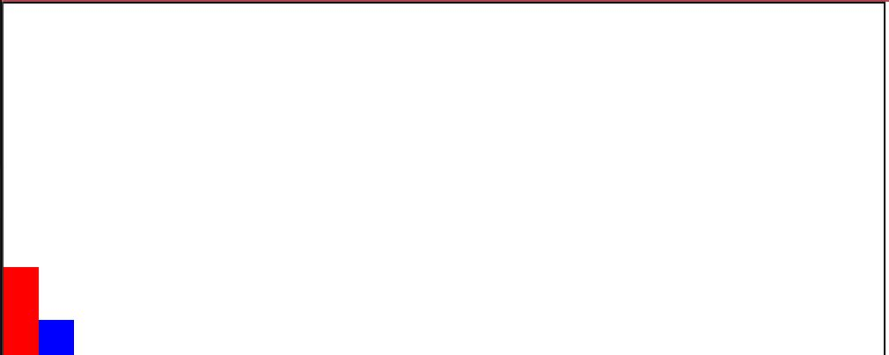

<h1 align="center">Block Jump</h1>

---

<h4 style="font-weight: bold;" align="center">"The Easiest Javascript Game Ever"</h4>

## Table of Contents

- [About](#about)
- [Usage](#usage)
- [Built With](#built_using)
- [Questions](#questions)
- [Screenshots](#screenshots)

## 

This is a simple block jump game built using just three files and less than 100 lines of code. I followed the tutorial given here: https://youtu.be/bG2BmmYr9NQ by YouTube channel KnifeCircus.

## 

1. Launch the [game](https://cleadi.github.io/simple-js-game/).
2. Click within the box to start the game. Click again to make the rectangular character jump up over the oncoming block.
3. You lose if the block hits your character.
4: Refresh the page if you want to play again!

## 

- HTML
- CSS
- JavaScript

## 

- If you wish to reach me, feel free to send me an email at cleadi@fastmail.com
- I can also be reached via LinkedIn: https://www.linkedin.com/in/dillon-cleaver/
- GitHub profile: https://github.com/cleadi

## 

